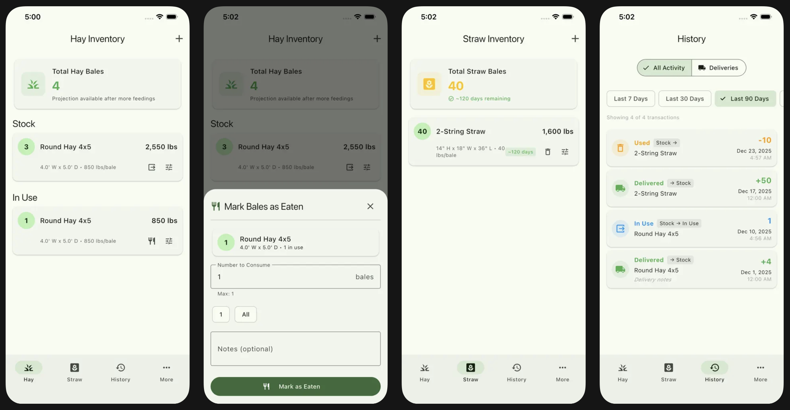

# HayTracker: Planning-Driven Development Meets Farm Life

<a href="https://apps.apple.com/us/app/haytracker/id6757104455" target="_blank" rel="noopener"></a>&nbsp;&nbsp;<a href="https://play.google.com/store/apps/details?id=com.codepasture.haytracker" target="_blank" rel="noopener"></a>

---

## The Problem: How Long Will This Bale Last?

I have donkeys and goats. They eat hay. A lot of hay.

We order more hay when we're down to the final bale, but I had no idea how long that last 4x5 round bale would actually last. Would it last two weeks? A month? I genuinely didn't know. Having that information would help me plan ahead instead of just reacting.

Beyond timing, I wanted to track costs. How much am I actually spending on hay per year? We're a small operation, but the expenses add up. I could put this in a spreadsheet, but an app on your phone makes it easy to log entries right there in the barn.

I wanted something simple: track deliveries, track usage, and build a history I could actually use for planning. HayTracker is that app.

## Planning-Driven Development in Practice

This was my first Flutter app built entirely with [Planning-Driven Development](https://www.nathanfox.net/p/planning-driven-development). Before writing any code, Claude Code and I created a comprehensive planning document—1,441 lines covering everything from database schema to UI specifications.

The planning phase addressed decisions that would otherwise interrupt development:
- How to model different bale types (small square, large round, etc.)
- The difference between hay tracking (sequential: stock → in use → consumed) and straw tracking (batch: stock → consumed)
- What consumption metrics to calculate and how to present depletion projections
- Pre-loaded bale type definitions based on industry standards

With the plan complete, implementation followed the roadmap. The first commit message tells the story: "Implement Phase 1 MVP of HayTracker." Not "initial commit" or "WIP"—a complete, working foundation built to spec.

The result: ~8,900 lines of Dart across 60 files, with clean architecture, full CRUD operations, consumption analytics, and CSV export/import. HayTracker later served as the architectural template for [PropaneTracker](https://www.nathanfox.net/p/propanetracker-from-planning-doc-to-working-app-90-minutes), demonstrating how a well-planned codebase becomes a reusable pattern.

## What the App Does

HayTracker tracks two materials with distinct workflows:

**Hay**: Uses three-state tracking. Bales move from Stock (in the barn) → In Use (currently feeding from) → Consumed. This models how many people feed hay: you open up a bale and pull from it until it's gone before starting the next one.

**Straw**: Uses simpler two-state tracking. Bales go directly from Stock → Consumed. Straw is typically used in batches for bedding—you spread several bales at once.

From this data, the app provides:

**Consumption Projections**: Based on your usage history, the app calculates bales per day and projects when you'll run out. Urgency levels (critical: <7 days, warning: 7-30 days, ok: >30 days) give you visual feedback at a glance.

**Delivery Tracking**: Record deliveries with quantity, cost per bale, and delivery fees. Build a purchase history you can reference when comparing suppliers or budgeting.

**Transaction History**: Every inventory change is logged—bales used, adjustments made, deliveries received. Full audit trail of your hay operation.

<p align="center">

</p>

## Technical Highlights

### Pre-loaded Bale Types

The app ships with nine standard bale sizes based on industry specifications:
- 2-string and 3-string small squares (hay and straw variants)
- 4x4, 4x5, and 5x5 round bales
- Large square bales

Users can customize dimensions and weights, or create entirely new bale types. This pre-seeding eliminates the "blank slate" problem where users have to configure everything before the app is useful.

### Domain-Driven Architecture

HayTracker follows clean architecture with a clear separation between domain logic and storage. The domain layer defines *what* the data looks like and what operations are possible; the data layer handles *how* it's persisted.

The domain model is a rich object with behavior:

```dart
class Inventory {
  final String id;
  final BaleType baleType;  // Full object, not just an ID
  final InventoryState state;
  final int count;
  final DateTime lastUpdated;

  double get totalWeight => baleType.typicalWeight * count;
}
```

The domain also defines repository interfaces—contracts that describe what operations are available:

```dart
abstract class InventoryRepository {
  Future<List<Inventory>> getInventoryByMaterial(MaterialType material);
  Future<void> updateInventory(Inventory inventory);
}
```

The data layer provides SQLite implementations that fulfill these contracts, handling the mapping between flat database rows and rich domain objects:

```dart
class InventoryRepositoryImpl implements InventoryRepository {
  Future<Inventory> _mapToDomain(Map<String, dynamic> map) async {
    // Resolve the foreign key to a full domain object
    final baleType = await _baleTypeRepository.getBaleTypeById(
      map['bale_type_id'] as String,
    );
    if (baleType == null) {
      throw Exception('BaleType not found: ${map['bale_type_id']}');
    }

    return Inventory(
      id: map['id'] as String,
      baleType: baleType,
      state: InventoryState.fromString(map['state'] as String),
      count: map['count'] as int,
      lastUpdated: DateTime.parse(map['last_updated'] as String),
    );
  }
}
```

Use cases orchestrate domain operations without touching storage details. Here's `UseBalesUseCase`, which moves bales from stock to in-use:

```dart
Future<void> execute({
  required BaleType baleType,
  required int count,
  String? notes,
}) async {
  // 1. Validate stock
  final stockInventory = await _inventoryRepository.getInventory(
    baleTypeId: baleType.id,
    state: InventoryState.stock,
  );
  if (stockInventory == null || stockInventory.count < count) {
    throw Exception('Not enough bales in stock');
  }

  // 2. Reduce stock
  final updatedStock = stockInventory.copyWith(
    count: stockInventory.count - count,
    lastUpdated: DateTime.now(),
  );
  await _inventoryRepository.updateInventory(updatedStock);

  // 3. Update in-use inventory
  // ... (create or increment in-use count)

  // 4. Record transaction for audit trail
  await _transactionRepository.addTransaction(transaction);
}
```

The use case works entirely with repository interfaces and domain objects—no SQL, no database details. This makes it testable without any infrastructure and portable if the storage layer ever changes.

## The Commit History

```
da7af8d Implement Phase 1 MVP of HayTracker
9913261 Add delivery entry form with inventory integration
30ac57e Add bale type management and deploy bales features
ce022cd Add consume bales feature and refactoring utilities
4516969 Add transaction/delivery history screens and inventory adjustment
2274eff Add CSV export/import functionality
526e35f Add consumption analytics and inventory projections
```

Each commit represents a complete feature, not incremental fumbling. The planning document served as both spec and checklist. When a phase was complete, it was *complete*—no circling back to fix architectural mistakes.

## Simple, But Useful

HayTracker won't manage your entire farm operation. It tracks one thing: how much hay and straw you have, and when you'll need more. That's it.

If you've ever run low on hay because you lost track, or if you want actual data when planning purchases, give it a try.

---

**Download**: [iOS App Store](https://apps.apple.com/us/app/haytracker/id6757104455) | [Google Play Store](https://play.google.com/store/apps/details?id=com.codepasture.haytracker)

**Related**: [PropaneTracker](https://www.nathanfox.net/p/propanetracker-from-planning-doc-to-working-app-90-minutes) - the propane tracking app built using HayTracker as a template

---

*For the methodology behind this app, see [Planning-Driven Development: The Single Biggest Productivity Multiplier with GenAI Agents](https://www.nathanfox.net/p/planning-driven-development).*
