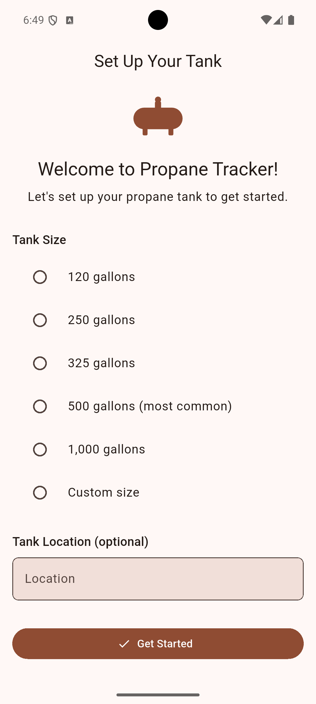
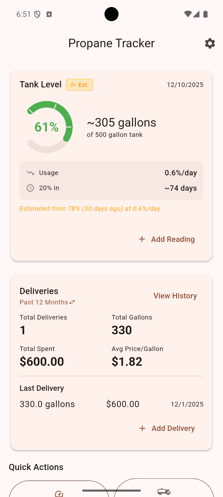
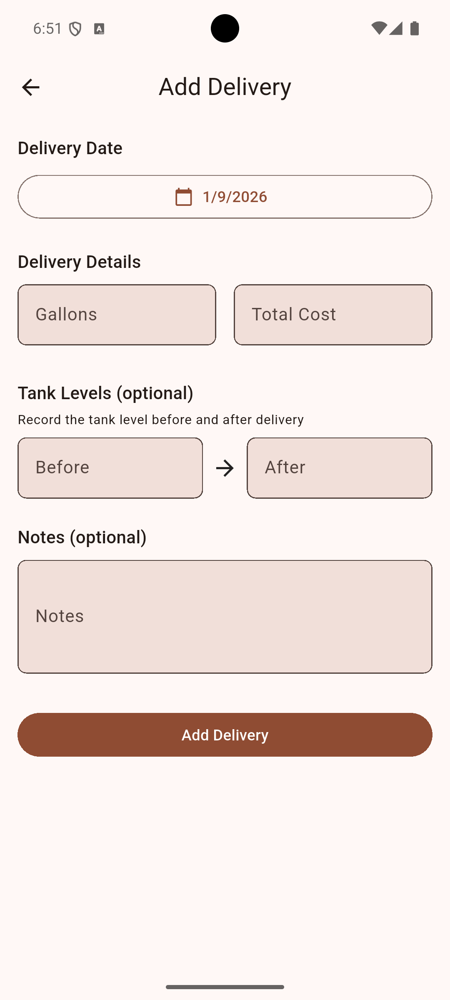
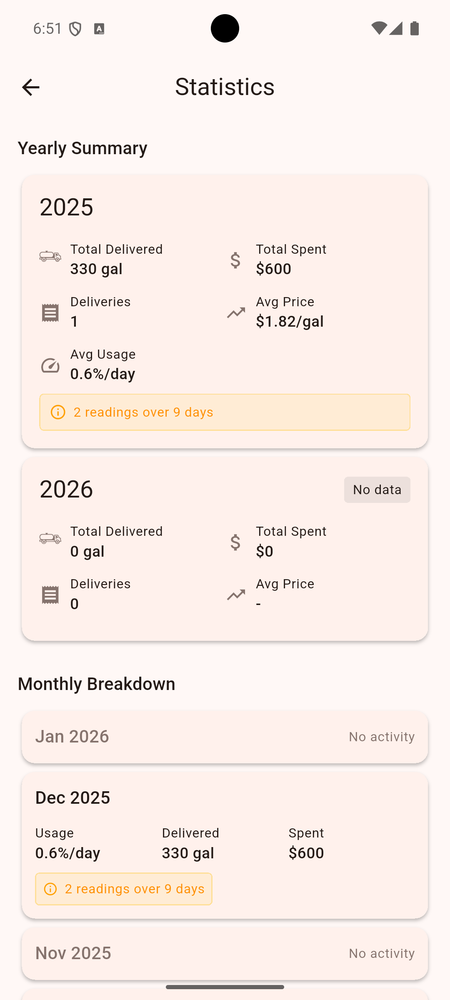

# PropaneTracker: From Planning Doc to Working App in 90 Minutes

<a href="https://apps.apple.com/us/app/propanetracker/id6757357644" target="_blank" rel="noopener"></a>&nbsp;&nbsp;<a href="https://play.google.com/store/apps/details?id=com.codepasture.propane_tracker&hl=en_US" target="_blank" rel="noopener"></a>

---

## The Problem: A 500-Gallon Mystery

I heat my home with a 500-gallon propane tank. My tank has a transmitter that sends data to the propane company, so deliveries happen automatically—I never have to call. But that data flows one direction. The propane company knows my consumption patterns. I don't.

For years, my "tracking system" was opening the Notes app on my phone and typing something like:

```
Jan 15 - 45%
Jan 22 - 38%
Feb 1 - delivery
Feb 3 - 82%
```

This was barely useful. I couldn't easily see consumption trends, couldn't analyze seasonal patterns, and had no way to plan ahead. Every year when it's time to decide how much propane to prebuy for the next heating season, I was guessing.

I wanted something simple: track deliveries, track tank readings, and build a history of my actual consumption. PropaneTracker is that app.

## Planning-Driven Development Meets Example-Driven Development

This project combined two approaches I've written about before:

**Planning-Driven Development**: Before writing any code, I created a comprehensive planning document with Claude Code. We worked through the domain model, architecture decisions, and implementation phases. The 1,066-line planning document covers everything from database schema to consumption calculation algorithms. (For more on this approach, see [Planning-Driven Development: The Single Biggest Productivity Multiplier with GenAI Agents](https://www.nathanfox.net/p/planning-driven-development).)

**Example-Driven Development**: I pointed Claude Code at [HayTracker](https://apps.apple.com/us/app/haytracker/id6757104455), a Flutter app I'd built previously, and said "follow these patterns." The architecture, file structure, testing approach, and Riverpod patterns were already proven. PropaneTracker just needed different domain models and UI.

The planning document took roughly an hour or two of back-and-forth with Claude Code. Then, with the plan in hand and HayTracker as an example, **the core of the mobile app was generated in 90 minutes**—about 6,300 lines of Dart across 51 files, roughly half the final codebase. But it was a *working* half: the architecture, persistence, state management, and basic UI were complete. Later commits added polish and features like CSV export and consumption statistics.

An hour and a half from planning document to working Flutter app with:
- Clean Architecture (domain/data/presentation layers)
- SQLite persistence
- Full CRUD for readings and deliveries
- Riverpod state management
- Unit tests for domain logic

This is the power of Claude Code with Opus 4.5 when you give it clear plans and good examples to follow.

## What the App Does

PropaneTracker is deliberately simple. It tracks two things:

**Tank Readings**: Check your gauge, enter the percentage. The app records when you took the reading (with the option to backdate) and optionally the temperature.

**Deliveries**: Record gallons delivered, total cost, and optionally the tank percentage before and after the fill. The app calculates price per gallon automatically.

From this data, the app provides:

**Consumption Statistics**: How many gallons per day you're using, broken down by month and year. Over time, this reveals seasonal patterns.

**Time to 20% Estimate**: Based on your recent consumption rate and current tank level, the app estimates when you'll hit 20% capacity.

**Delivery History**: Total gallons purchased, total cost, average price per gallon over the last 12 months.

<p align="center">
&nbsp;&nbsp;
&nbsp;&nbsp;
&nbsp;&nbsp;

</p>

## Technical Highlights

A few aspects of the implementation worth noting:

### Unified Timeline with Dual Metrics

The most interesting technical challenge was consumption calculation. You have two data sources:
- **Gauge readings**: Frequent but approximate (±5% accuracy)
- **Delivery records**: Exact but infrequent

The `ConsumptionCalculatorService` merges both into a unified timeline and calculates two complementary metrics:

1. **Percentage per day** (from gauge readings) - good for short-term monitoring
2. **Gallons per day** (from deliveries) - precise, good for cost projection

When a delivery includes both `percentageBefore` and `percentageAfter`, the service can do normalized calculations that account for different fill levels between deliveries.

### Clean Architecture

The project follows three-layer clean architecture:

```
lib/
├── domain/       # Pure Dart: models, repositories (interfaces), use cases, services
├── data/         # SQLite implementation of repositories
└── presentation/ # Flutter UI, Riverpod providers, screens, widgets
```

The domain layer has zero Flutter dependencies. Use cases are single-responsibility classes. This makes the business logic trivially testable.

### Testable by Design

No `DateTime.now()` calls in services. Every method takes explicit date parameters:

```dart
Future<CurrentLevelEstimate> getCurrentLevelEstimate({
  required DateTime asOf,
  required DateTime rateStart,
  required DateTime rateEnd,
})
```

This means tests use deterministic dates and produce deterministic results. The test suite includes 18 test files covering models, use cases, services, repositories, and widgets.

### Dual Timestamps on Readings

A small UX detail that makes a big difference: each reading has both `readingDateTime` (when you checked the gauge) and `entryDateTime` (when you entered it in the app). This supports the common case of checking the tank in the morning but entering the data later.

## The Commit History Tells the Story

```
d1fea61 Add initial planning document for Propane Tracker app
1a11512 Phase 1: Flutter project setup and domain layer foundation
1fe6bf4 Phase 2: Repository implementations and use cases
158c14b Phase 3: Riverpod state management
95056e7 Phase 4: Presentation layer (UI)
```

Five commits took the project from planning document to working app. The subsequent commits added polish: custom icons, CSV export/import, consumption statistics UI, App Store compliance.

The methodical, phase-based approach meant each step built cleanly on the previous one. No major refactoring. No architectural pivots. The plan worked.

## Simple, But Useful

PropaneTracker isn't trying to be clever. It's a digital replacement for my Notes app with just enough structure to be useful. Track what goes in (deliveries), track what's left (readings), and build a consumption history you can actually use—whether that's for prebuy decisions, budgeting, or just understanding where your heating dollars go.

If you heat with propane and want your own data, give it a try.

---

**Download**: [iOS App Store](https://apps.apple.com/us/app/propanetracker/id6757357644) | [Google Play Store](https://play.google.com/store/apps/details?id=com.codepasture.propane_tracker&hl=en_US)

**Related**: [HayTracker](https://apps.apple.com/us/app/haytracker/id6757104455) - the Flutter app that served as the architectural template

---

*For the methodology behind rapid app development with AI, see [Planning-Driven Development: The Single Biggest Productivity Multiplier with GenAI Agents](https://www.nathanfox.net/p/planning-driven-development).*
