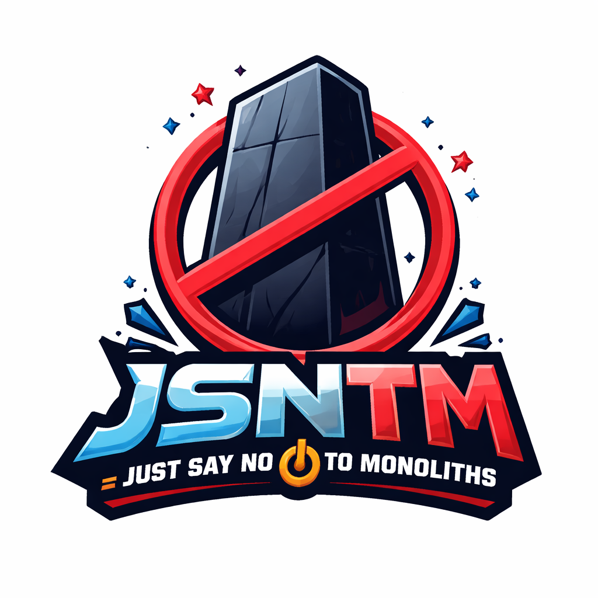

# JSNTM: Micro-Frontends with a Svelte Shell



This is Part 2 of the [JSNTM (Just Say No to Monoliths)](https://www.nathanfox.net/p/jsntm-just-say-no-to-monoliths-in) series. In that post, I committed to no longer creating monolithic services. But the same principle applies to the frontend.

## The Frontend Monolith Problem

We've been fighting monoliths on the backend for years. Microservices, bounded contexts, independent deployability—we know the patterns. Yet on the frontend, we often build massive single-page applications where every team commits to the same repo, every feature ships together, and a bug in one component can block the entire release.

The same excuses apply: "It's easier to set up one project." "Shared components are simpler in a monorepo." "The overhead of separate deployments isn't worth it."

Sound familiar?

## Micro-Frontends: The Same Solution

Micro-frontends apply microservice principles to the UI layer. Each bounded context owns its frontend. Teams deploy independently. Technology choices can vary by module. The shell orchestrates composition without coupling.

The concept isn't new, but the implementation has historically been painful. Module federation configuration, webpack complexity, runtime dependency management—the overhead rivaled the backend service creation problem I described in Part 1.

GenAI changes this too.

## A Working Reference Implementation

I've built a reference implementation demonstrating these patterns:

**Live Demo:** [https://mfe-svelte-shell-example.nathanfox.net](https://mfe-svelte-shell-example.nathanfox.net)

**Source Code:** [https://github.com/nathanfox/mfe-svelte-shell-example](https://github.com/nathanfox/mfe-svelte-shell-example)

The architecture: a Svelte 5 shell orchestrating five different micro-frontends, each built with a different framework—React, Vue, Svelte, SolidJS, and Angular. All running together, all independently deployable.

## Why Svelte for the Shell?

The shell is the foundation everything builds on. Its runtime ships with every page load. Size and performance matter.

Svelte 5 compiles to vanilla JavaScript with a ~1.6-3 KB runtime. React's runtime is ~40+ KB. When your shell's job is to load and orchestrate other frameworks, you don't want framework overhead competing with your actual applications.

Beyond size:
- No Virtual DOM overhead
- Built-in state management with runes
- Clean syntax that GenAI tools generate reliably
- No framework conflicts—it compiles away

The shell should be invisible infrastructure. Svelte achieves this.

## The Architecture

```
┌─────────────────────────────────────────────────────────────┐
│                        Svelte Shell                         │
│  ┌─────────┐  ┌─────────────┐  ┌─────────────────────────┐  │
│  │ Header  │  │ Navigation  │  │     MFE Container       │  │
│  │ (Auth)  │  │  (Dynamic)  │  │  (Mount/Unmount Point)  │  │
│  └─────────┘  └─────────────┘  └─────────────────────────┘  │
└─────────────────────────────────────────────────────────────┘
                              │
        ┌─────────────────────┼─────────────────────┐
        │                     │                     │
        ▼                     ▼                     ▼
┌───────────────┐   ┌───────────────┐   ┌───────────────┐
│  React MFE    │   │   Vue MFE     │   │  Svelte MFE   │
│  (Dashboard)  │   │  (Analytics)  │   │  (Reports)    │
│   Port 5001   │   │   Port 5002   │   │   Port 5003   │
└───────────────┘   └───────────────┘   └───────────────┘
```

Each MFE is a self-contained application with its own build, its own dependencies, and its own deployment pipeline.

## The MFE Lifecycle Contract

Every micro-frontend exports three functions:

```typescript
export async function bootstrap(props: MfeProps): Promise<void>
export async function mount(props: MfeProps): Promise<void>
export async function unmount(props: MfeProps): Promise<void>
```

The shell provides everything an MFE needs:

```typescript
interface MfeProps {
  container: HTMLElement;           // Where to render
  basePath: string;                 // Route prefix
  auth: AuthContext;                // User state, login/logout
  eventBus: EventBus;               // Cross-MFE communication
  navigate: (path: string) => void; // Shell navigation
  theme: 'light' | 'dark';
  navigation: NavigationApi;        // Dynamic route registration
  cache: MfeCache;                  // Per-MFE state cache
}
```

This contract is framework-agnostic. React, Vue, Svelte, Angular—they all implement the same interface. The shell doesn't care what's inside the MFE, only that it honors the lifecycle.

## Framework Implementation Examples

**React:**
```typescript
import { createRoot } from 'react-dom/client';
import App from './App';

let root: Root | null = null;

export async function mount(props: MfeProps) {
  root = createRoot(props.container);
  root.render(<App {...props} />);
}

export async function unmount() {
  root?.unmount();
}
```

**Vue:**
```typescript
import { createApp } from 'vue';
import App from './App.vue';

let app: App | null = null;

export async function mount(props: MfeProps) {
  app = createApp(App, props);
  app.mount(props.container);
}

export async function unmount() {
  app?.unmount();
}
```

**Svelte:**
```typescript
import { mount, unmount as svelteUnmount } from 'svelte';
import App from './App.svelte';

let app: any = null;

export async function mount(props: MfeProps) {
  app = mount(App, { target: props.container, props });
}

export async function unmount() {
  svelteUnmount(app);
}
```

Same pattern, different frameworks. The shell loads each MFE dynamically and calls these lifecycle hooks.

## Native Federation: No Webpack Required

The implementation uses Native Federation—ES Modules loaded directly by the browser, no Module Federation webpack plugin needed.

Each MFE builds to a single `remoteEntry.js`:

```typescript
// vite.config.ts
build: {
  lib: {
    entry: 'src/main.tsx',
    fileName: 'remoteEntry',
    formats: ['es'],
  },
}
```

The shell imports dynamically:

```typescript
const module = await import(/* @vite-ignore */ mfe.entry);
await module.mount(props);
```

This is future-proof. No bundler lock-in. Standard ES Modules that browsers understand natively.

## Manifest-Based Registration

MFEs register via a static JSON manifest:

```json
{
  "id": "react-example",
  "name": "React Dashboard",
  "entry": "/mfes/react-example/remoteEntry.js",
  "route": "/react",
  "menu": {
    "label": "Dashboard",
    "icon": "📊",
    "order": 1,
    "children": [
      { "label": "Overview", "path": "/react", "icon": "🏠" },
      { "label": "Analytics", "path": "/react/analytics", "icon": "📈" }
    ]
  }
}
```

Adding a new MFE means adding an entry to the manifest and deploying the bundle. The shell discovers it automatically.

## Shell-MFE Communication

MFEs communicate with the shell through an event bus:

```typescript
// MFE emits event to shell
props.eventBus.emit('report:generated', { id: 123, name: 'Q4 Report' });

// Shell listens and can update shared state, trigger notifications, etc.
eventBus.on('report:generated', (data) => {
  showNotification(`Report ${data.name} created`);
});
```

Since only one MFE is mounted at a time (navigation unmounts the previous MFE), direct MFE-to-MFE communication isn't the primary use case. Instead, the event bus handles MFE-to-shell communication: auth state changes, navigation requests, notifications, and analytics. The shell's state cache can persist data between MFE sessions when needed.

## Dynamic Route Registration

MFEs can register routes at runtime based on user permissions:

```typescript
export async function mount(props: MfeProps) {
  const routes = [
    { label: 'Overview', path: props.basePath, icon: '🏠' },
    { label: 'Analytics', path: `${props.basePath}/analytics`, icon: '📈' },
  ];

  if (props.auth.user?.roles?.includes('admin')) {
    routes.push({
      label: 'Admin',
      path: `${props.basePath}/admin`,
      icon: '🛡️',
    });
  }

  props.navigation.registerRoutes(routes);
  // ...
}
```

The shell's secondary navigation updates automatically. Admin users see admin routes; regular users don't.

## Deployment

The build process is straightforward:

```bash
# Build all MFEs in parallel
npm run build:mfes

# Build shell
npm run build:shell

# Copy MFE bundles into shell dist
npm run copy:mfes
```

Output structure:
```
dist/
├── index.html
├── manifest.json
└── mfes/
    ├── react-example/remoteEntry.js
    ├── vue-example/remoteEntry.js
    ├── svelte-example/remoteEntry.js
    └── ...
```

Deploy to any static host. The demo runs on Netlify with a single configuration file.

**Note:** This build process is simplified for the example—all MFEs build together and copy into a single deployment. In production, each MFE builds and deploys with its owning microservice. The inventory service's CI/CD pipeline builds both the API and its MFE bundle. The manifest points to each service's hosted assets:

```json
{
  "id": "inventory",
  "entry": "https://inventory-api.example.com/mfe/remoteEntry.js",
  "route": "/inventory"
}
```

The shell and each microservice deploy independently. When the inventory team ships a new feature, they deploy their service—API and UI together. No coordination required.

## The JSNTM Connection

This is microservices for the frontend:

- **Bounded contexts** - Each MFE owns a domain (dashboard, analytics, reports)
- **Independent deployability** - Ship features without coordinating releases
- **Technology flexibility** - Choose the right framework for each module
- **Team autonomy** - Teams own their MFE end-to-end
- **Fault isolation** - A bug in one MFE doesn't crash the others

The same reasons we decompose backend monoliths apply to frontend monoliths.

**The key insight: a microservice can own its MFE.**

Your inventory microservice doesn't just expose an API—it ships with its own UI module. The same repo, the same team, the same deployment pipeline. When you deploy the inventory service, you deploy its frontend too. The bounded context is complete from database to UI.

This is true vertical slicing. No more coordinating between "backend team" and "frontend team" for a single feature. The service owns everything.

## GenAI and MFE Creation

Here's where it connects to the [original JSNTM post](https://www.nathanfox.net/p/jsntm-just-say-no-to-monoliths-in).

Creating a new MFE with this architecture means:
- Copy an existing MFE folder
- Update the manifest entry
- Implement the three lifecycle functions
- Build and deploy

With GenAI coding agents, this is a conversation:

"Create a new MFE like the React example, but for inventory management. It should have three tabs: Stock Levels, Reorder Alerts, and Supplier Contacts."

The agent copies the pattern, scaffolds the components, wires up the lifecycle hooks. You review and refine. Hours, not days.

The same [Example-Driven Development](https://www.nathanfox.net/p/example-driven-development-using-ai-agent-claude-code) pattern applies. Your existing MFEs become the specification for new ones.

## A Blueprint, Not a Finished Product

This implementation is intentionally a starting point—a blueprint to build upon, not a production-ready framework.

The patterns are established, but your needs will differ. Some possibilities to extend:

- **Dynamic shell menu updates** - MFEs could register top-level navigation items, not just secondary routes
- **Shared design tokens** - CSS custom properties, fonts, and styling conventions loaded by the shell for visual consistency across MFEs
- **Cross-MFE state synchronization** - Persist and sync state across MFE sessions via the shell
- **MFE-to-MFE messaging** - Queue events for MFEs that aren't currently mounted
- **Lazy manifest loading** - Discover MFEs dynamically from a backend service
- **A/B testing support** - Load different MFE versions based on user segments
- **Analytics integration** - Shell-level tracking of MFE mount/unmount, navigation, errors

The point is demonstrating the architecture and lifecycle contract. Fork it, extend it, make it yours.

## Try It Yourself

**Live Demo:** [https://mfe-svelte-shell-example.nathanfox.net](https://mfe-svelte-shell-example.nathanfox.net)

**Source Code:** [https://github.com/nathanfox/mfe-svelte-shell-example](https://github.com/nathanfox/mfe-svelte-shell-example)

The repository includes:
- Complete shell implementation with auth, navigation, event bus
- Five framework examples (React, Vue, Svelte, SolidJS, Angular)
- Comprehensive documentation in the `docs/` folder
- Development and production configurations

Clone it, run `npm install && npm run dev`, and you'll have a working MFE environment in minutes. Then extend it for your use case.

## The Commitment Continues

Part 1 was backend: no more monolithic services.

Part 2 is frontend: no more monolithic SPAs.

The patterns exist. The tooling is mature. GenAI makes the setup trivial. The only barrier is discipline.

JSNTM: Just Say No to Monoliths—on both sides of the stack.

---

*This post is part of the JSNTM series on eliminating monoliths with GenAI-assisted development. See also [Part 1: Just Say No to Monoliths in the GenAI Age](https://www.nathanfox.net/p/jsntm-just-say-no-to-monoliths-in).*

---

*This post was written with Claude Code. I described the concept, provided the reference implementation, and Claude helped draft and structure the content. I reviewed and edited the result. The logo was generated with ChatGPT. This is how I work now. You can see the revision history in my [blog posts repo](https://github.com/nathanfox/nathan-fox-net-posts).*
